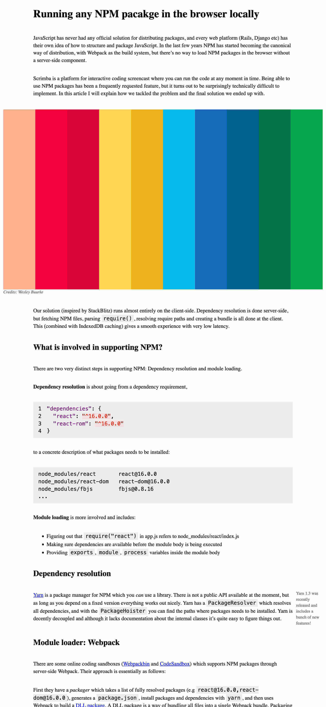

# Article Layout

This is a project from the Scrimba [CSS Grid](https://scrimba.com/learn/cssgrid/creating-an-article-layout-css-grid-tutorial-cdp76sD) course.

## About The Project

This project uses a grid layout to render the article on the page.

Live Site: https://article-layout-by-alphfonti.netlify.app/

## Built with

- CSS Grid

## Acknowledgments

- [Magnus Holm](https://github.com/judofyr)
